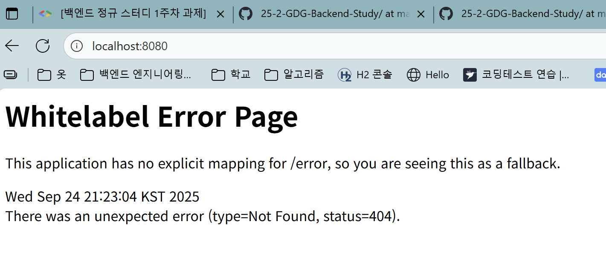

# 1주차 백엔드 강의 정리 
____
#### 인터넷 
- 전 세계 컴퓨터 와 기기를 연결하는 거대한 글로벌 네트워크 
#### 웹 
- 인터넷 위에서 동작하는 서비스 중 하나 
- 인터넷에 견결된 전 세계 사용자들이 서로의 정보를 공유 할 수있는 곳 

#### client - sever  model : 컴퓨터와 컴퓨터가 통신하는구조 

client : 
- 요청(request)을 보내고 , 서버의 응답(결과)를 받음
sever :  
- client의 request을 받아 처리하고 그에 대한 response로 반환 

#### http://www.example.com:5883/category/food.html?topic=pizza 

Host(www.example.com) :
- 리소스가 위치한 서버의 IP 주소 혹은 도메인 

Post(:5883) : 
- 서버의 특정 네트워크 포트 번호(일반적으로 생략 )

Path (/category/food.html) : 
- 서버 내에서 원하는 리소스의 결로 

Query(?topic=pizza) : 
- 서버에 추가적인 정보를 보내는 파라미터로, ?뒤에 key-value 형식으로나열 

Scheme(, Protocol / http) : 
- 컴퓨터와 같은 장치들 사이에서 데이터를 주고 받는 방식, 통신하기 위한 규칙 

#### HTTP 주요 상태 코드 

200 OK : 요청이 성공적으로 처리됨 
201 Created : 요청이 성공적으로 처리되어 새로운 리소스가 생성됨
400 Bad Request : 클라이언트의 요청이 잘못되어 서버가 이해하지 못함 
404 Not Found : 지정한 리소스를 찾을 수 없음 
500 Internal Sever Error : 서버 내부 오류로 요청을 처리할수 없음 

#### 프론트엔트, 백엔드
프론트엔드 
- 사용자가 직접 보고 상호작용하는 화면 , 사용자 인터페이스(UI)를 개발 

백엔드 
- 사용자의 요청을 받아 실제 동작을 처리하고 데이터를 저장, 관리 

#### REST(REpresentational State Transfer)
네트워크 아키텍처 스타일로, HTTP의 장점을 최대한 활용할수있는 아키텍처

1. 자원(Resource) - url
모든 자원은 고유한 ID를 가지며, 이 ID는 /student/1 같은 HTTP URL이다.

2. 행위(Verb) - Method 
자원을 조작하기 위해 HTTP Method를 사용한다

3. 표현(Representation)
서버와 클라이언트가 데이터를 주고받는 형식으로, JSON 형식이 일반적이다 

#### API = 문법가지고 어떻게 대화를 할지 적어둔 대본 
한 프로그램이 다른 프로그램의 기능이나 데이터를 사용할 후 있도록 미리 정해놓은 약속(규칙)이자 소통 창고

#### REST API
자원을 고유한 URL로 식별하고, 해당 자원에 대한 행위를 HTTP메서드로 정의하며, 그 결과를 JSON같은 표준형식으로 표현하는 웹서비스 아키텍처 스타일 
즉 -> REST의 원칙을 준수해 만든 API이자 HTTP의 모범사례 

#### client side -rendering 
- 생긴이유: 
글 하나 고쳐야하는것 때문에 http 페이지를 다시받아야하는 상황발생 -> 네트워크낭비, 사용자 화면 깜빡거림 상호작용 웹서비스에따라 이런방식이 비효율적이라고 생각
 
- 뜻: 
화면의 뼈대를 재사용을하되 data만 서버에서 받아와서 부분적으로 만 다시 그리자
이걸 client쪽에서 다시 rendering하는것

# 온라인 쇼핑몰 프로젝트 API 명세서
## 상품 기능 

- 상품 정보 등록 
HTTP Method : POST
items/{orderId}

- 상품 목록 조회 
HTTP Method : GET
items/

- 개별 상품 정보 상세 조회 
HTTP Method : GET
items/{orderId}

- 상품 정보 수정  PATCH
HTTP Method :
items/{orderId}

- 상품 삭제 
HTTP Method : DELETE
items/{orderId}

## 주문 기능 

- 주문 정보 생성 
HTTP Method : PUT
/orders/{orderId}

- 주문목록 조회 
HTTP Method : GET
/orders/

- 개별 주문 정보 상세 조회 
HTTP Method : GET
/orders/{orderId}
주문 취소 

- HTTP Method : DELETE
/orders/{orderId}

